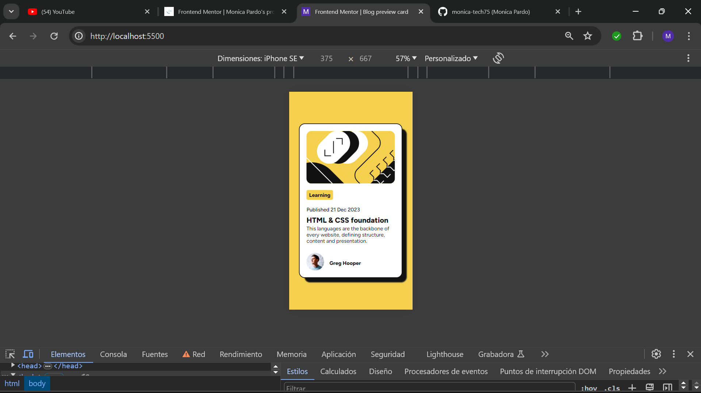
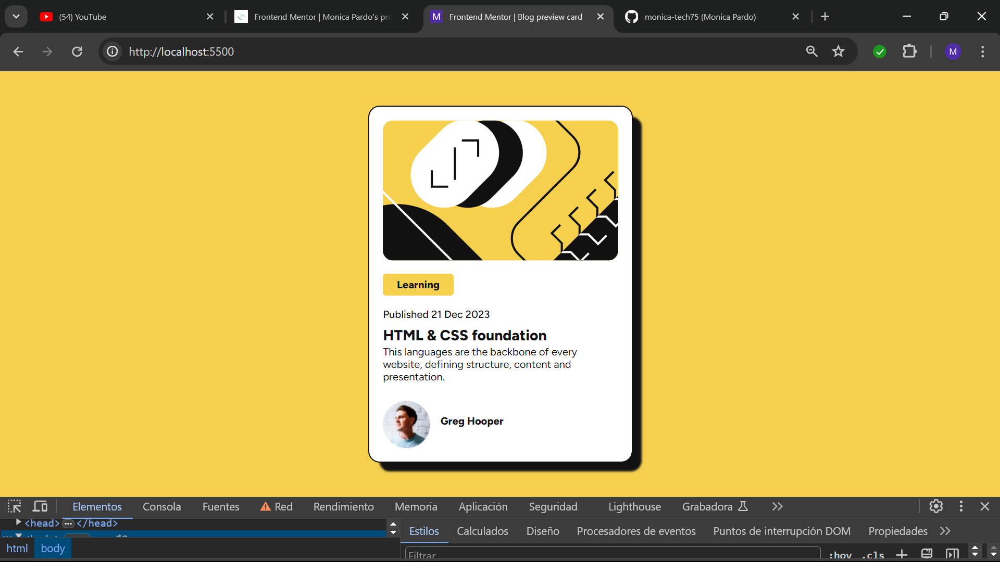

# Frontend Mentor - Blog preview card solution

This is a solution to the [Blog preview card challenge on Frontend Mentor](https://www.frontendmentor.io/challenges/blog-preview-card-ckPaj01IcS). Frontend Mentor challenges help you improve your coding skills by building realistic projects. 

## Table of contents

- [Overview](#overview)
  - [The challenge](#the-challenge)
  - [Screenshot](#screenshot)
  - [Links](#links)
- [My process](#my-process)
  - [Built with](#built-with)
  - [What I learned](#what-i-learned)
  - [Continued development](#continued-development)
  - [Useful resources](#useful-resources)
- [Author](#author)
- [Acknowledgments](#acknowledgments)


## Overview

### The challenge

Users should be able to:

- See hover and focus states for all interactive elements on the page

### Screenshot






### Links

- Solution URL: [Add solution URL here](https://github.com/monica-tech75/blog-preview-card)


## My process
I start placing the card in the center using grid in the body. I don't know if is the correct way to do it, but it work.
I also create variables for the colors. Then I put the images.(It's my cat, moony).
I also start trying not to use pixels so much.
Recently I learn about vh and vw and is amazing.

### Built with

- Semantic HTML5 markup
- CSS custom properties
- CSS Grid
- Mobile-first workflow


### What I learned

It's my first time I use variables in CSS and also Grid, normaly I use flexbox but sometimes is complicated with flexbox.
```css

:root {
  --yellow: hsl(47, 88%, 63%);
  --white: hsl(0, 0%, 100%);
  --grey: hsl(0, 0%, 50%);
  --black: hsl(0, 0%, 7%);
}
body {
  display: grid;
  place-content: center;
}
```


### Continued development

I gonna start to learn about grid, I think It can be easy to understand or less complicated than flexbox.


## Author

- Website - [Monica Pardo](https://github.com/monica-tech75)
- Frontend Mentor - [@monica-tech75](https://www.frontendmentor.io/profile/monica-tech75)


## Acknowledgments

Thanks to Frontend Mentor for giving me the opportunity to practice with this amazing proyects.
